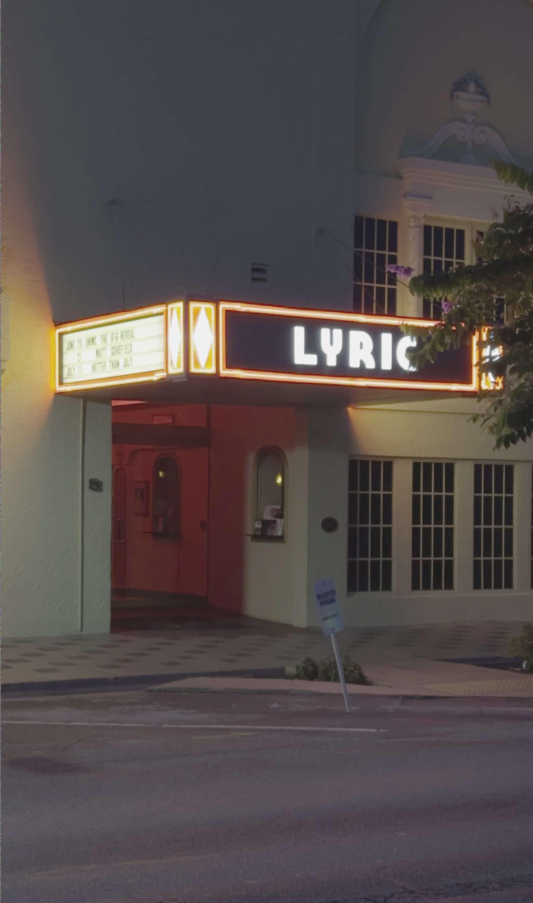
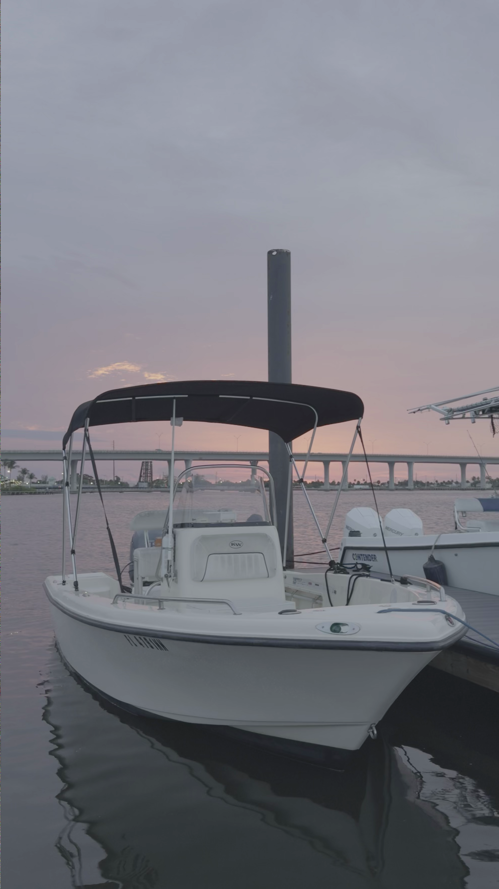

# Film Emulation

My experiment in film emulation.

## Before/After Photos

These photos have no editing past what the program outputs.







## Setup

First, acquire short videos to emulate film on. The first frame is treated as a photo. This is because the program was originally designed to process Apple ProRes Log, which is a video format.

Then clone the repository and cd in:
```shell
$ git clone https://github.com/AlexanderJCS/film-emulation-cpp.git

$ cd ./film-emulation-cpp
```

Then create the `in`, `out`, and `luts` directory:
```shell
$ mkdir in out luts
```

Place your input video(s) into the `in` directory. The program has been tested on `.mov` files only, but most video formats should work fine.

Download the appropriate LUT to convert from your video format to a filmic look. Place the LUT in the `luts` directory. I use [these](https://www.tobiamontanari.com/apple-log-filmic-looks-luts/) free "Filmic Looks" LUTs from Tobia Montanari, modified from the DaVinci Resolve LUTs. If you do not use these LUTs, you will need to change the `lutPath` variable in `main.cpp` to reflect your appropriate LUT.

Finally, compile and run the program. This project uses CMake, so it should be relatively straightforward to compile. When running the program, make sure that the working directory is set to the project root instead of your build folder.

If you have any questions about the project setup, please create an issue. I'd be happy to help.
